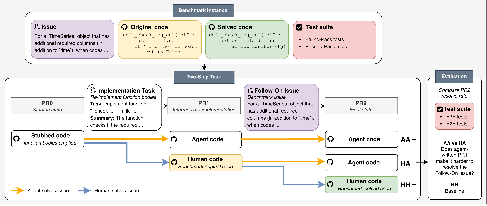

# Is Agent Code Less Maintainable Than Human Code?

[](https://arxiv.org/abs/2509.XXXXX) [](https://huggingface.co/your-link) [](https://huggingface.co/datasets/username/codethread-trajectories)

Maintainability is a core dimension of software engineering, shaping how code is written, reviewed, and developed over time. While coding agents have demonstrated strong performance on single-issue tasks, it remains unclear how maintainable their code is when future agents build on top of it, potentially leading to compounding downstream effects. We investigate how agent code compares to human code in these maintenance settings, presenting **CodeThread**, a framework to construct controlled experiments from repository-level coding benchmarks. Applying CodeThread to four frontier coding agents and four benchmarks, we find that agents are less effective at resolving tasks when building on agent code compared to human code, with task resolve rate drops of up to 13.1%. Regression analysis reveals that many traditional software engineering maintainability metrics do not explain this difference. Instead, the clearest signals are subtler behavioral differences in agent code, such as changes to input validation and error handling, along with differences in downstream code size and task difficulty. These findings highlight the need to evaluate these systems not only by immediate task resolution but also by code maintainability, and point to potential sources of downstream errors introduced by agent code.

## CodeThread Framework



CodeThread turns any repository-level coding benchmark into a controlled *maintenance* experiment. For each task we build a **chain** of two dependent pull requests on the same codebase:

1. **PR&nbsp;1 (the base layer).** A first task is resolved either by a **human** (the benchmark's gold patch) or by a **coding agent**. This produces two parallel versions of the repository that differ only in who wrote the first change.
2. **PR&nbsp;2 (the downstream task).** A second, dependent task is then attempted *on top of* each version of PR&nbsp;1. Because the only thing that changes between the two arms is the authorship of PR&nbsp;1, any difference in PR&nbsp;2's resolve rate is attributable to how maintainable the underlying code is.

Comparing the agent-base arm against the human-base arm isolates the effect of building on agent code versus human code. The framework is benchmark-agnostic and currently supports four repository-level benchmarks (single-issue, feature, and multilingual variants).

The dataset that backs these experiments is built by the two-stage pipeline under [`dataset/scripts/`](dataset/scripts/README.md), which turns any SWE-bench-style benchmark into stubbed tasks with generated problem statements. See [`dataset/scripts/README.md`](dataset/scripts/README.md) for the full walkthrough and instructions on **extending CodeThread to other benchmarks**.

> **Dataset.** The constructed chains and agent trajectories are released on Hugging Face (links above).

## Setup Guide

The experiment harness is built on [mini-swe-agent](https://github.com/SWE-agent/mini-SWE-agent), vendored under [`mini-swe-agent/`](mini-swe-agent/). Sandboxing uses [Singularity/Apptainer](https://apptainer.org/) by default; Docker support can be extended by following the Singularity environment as a template (`mini-swe-agent/src/minisweagent/environments/`).

```bash
# 1. Install the agent harness (editable) — see mini-swe-agent/README.md
cd mini-swe-agent && pip install -e . && cd ..

# 2. Provide model API keys (any subset, depending on which agents you run)
export ANTHROPIC_API_KEY=...
export OPENAI_API_KEY=...
export GEMINI_API_KEY=...
# For self-hosted / open-weight models served via vLLM, point litellm at the
# hosted_vllm endpoint and register the model in scripts/model_registry.json.
```

To also install the multi-language **maintainability-metrics** toolchain (Python
analysis stack + Rust/Go metric CLIs) alongside the agent, run the bundled
setup script instead:

```bash
cd env && ./setup_env.sh        # installs mini-swe-agent + the metrics toolchain
```

See [`env/README.md`](env/README.md) for the full environment guide, and the
per-component docs under `mini-swe-agent/src/minisweagent/{agents,models,environments,config}/README.md`.

> **Container images.** Runs expect benchmark images to be available locally and
> are pointed at them with `--path-local-images <dir>`; the Singularity
> environment otherwise pulls `docker://` images on demand.

All stages below are driven by the `mini-extra` entry points (`swebench`, `swebenchpro`, `featbench`), wrapped in ready-to-edit per-benchmark scripts under [`scripts/`](scripts/) (see the next section).

## Generating Patches & Evaluation

Patch generation and evaluation are driven by the same `mini-extra` entry points, so we ship one ready-to-edit wrapper per benchmark under [`scripts/`](scripts/). Each script walks the **full CodeThread chain end-to-end** — resolve PR&nbsp;1, prepare the chain, resolve PR&nbsp;2 on top of it, and grade both the agent-base and human-base (HA) arms — with all flags and paths laid out inline. Read the script for the benchmark you care about and edit the variables at the top (model config, output dir, image path, workers).

| Benchmark | Wrapper script |
|-----------|----------------|
| SWE-bench (Verified) | [`scripts/run_swebench.sh`](scripts/run_swebench.sh) |
| SWE-bench Multilingual | [`scripts/run_swebenchmulti.sh`](scripts/run_swebenchmulti.sh) |
| SWE-bench Pro | [`scripts/run_swebenchpro.sh`](scripts/run_swebenchpro.sh) |
| FeatBench | [`scripts/run_featbench.sh`](scripts/run_featbench.sh) |
| Gold / human-base baseline | [`scripts/gold/run_gold_swebenchpro.sh`](scripts/gold/run_gold_swebenchpro.sh) |

What the wrappers string together:

- **Patch generation** — `mini-extra {swebench,swebenchpro,featbench}` runs the agent against the benchmark, writing predictions to `--output`.
- **Chain prep** — from a completed PR&nbsp;1 run, the helpers in [`scripts/utils/`](scripts/utils/) build the PR&nbsp;1 → PR&nbsp;2 wiring: `synthetic_chains.py` (synthetic report) → `get_instance_ids.py` (filter set) → `generate_2ndPRJson.py` (writes `secondPRMapper.json`, the `--init-patch-map` input that stacks PR&nbsp;2 on top of PR&nbsp;1).
- **Evaluation** — re-invoke with `--run-only-eval` to apply patches in the sandbox, run the test suite, and grade pass/fail; add `--generate-final-report` to aggregate per-instance results (logic in `mini-swe-agent/src/minisweagent/evaluation/reporting.py`). Use `--gold` to evaluate the human gold patches (the human-base arm / upper bound).

Key flags to know when editing a wrapper: `--filter-ids "id1|id2|..."` (restrict instances), `--path-local-images <dir>` (use pre-pulled images), `--multilingual` (multilingual variant), `--init-patch-map <file>` (apply PR&nbsp;1 before the agent starts).

## Maintainability metrics

For every PR we compute a suite of traditional software-engineering maintainability metrics (size, complexity, and behavioral signals such as input-validation and error-handling changes) over the functions each patch modifies.

- Per-instance metric extraction: `mini-swe-agent/src/minisweagent/evaluation/maintainability_metrics.py` (writes `maintainability_metrics.json` and `modified_functions.json` per instance).
- Multi-language metric backends (Python via `radon`/`complexipy`; Rust/C/Java/JS/TS via `rust-code-analysis-cli`; Go via `gocognit` + the custom `go-halstead`) are installed by [`env/setup_env.sh`](env/setup_env.sh) — see [`env/README.md`](env/README.md).
- Batch correction/recompute wrappers live under [`scripts/maintability/`](scripts/maintability/) (e.g. `correct_claude_swebenchpro.sh`).

The metric pipeline locates the three non-Python CLIs via environment variables. Their built-in defaults are absolute paths from the authors' machine, so **to reproduce the metrics you must export these to point at your own binaries** (otherwise non-Python languages silently fall back to `lizard`, cyclomatic-complexity only):

```bash
export RCA_CLI="$HOME/.cargo/bin/rust-code-analysis-cli"   # Rust / C / Java / JS / TS
export GO_HALSTEAD_CLI="$HOME/.go/bin/go-halstead"         # Go: Halstead + MI + CC
export GOCOGNIT_CLI="$HOME/.go/bin/gocognit"               # Go: cognitive complexity
```

`env/setup_env.sh` installs these binaries to exactly those paths.

## Attribution

This project builds on [mini-swe-agent](https://github.com/SWE-agent/mini-SWE-agent) (MIT License).

If you use CodeThread, please cite:

```bibtex
@article{codethread2026,
  title   = {Is Agent Code Less Maintainable Than Human Code?},
  author  = {<authors>},
  journal = {arXiv preprint arXiv:2509.XXXXX},
  year    = {2026}
}
```
